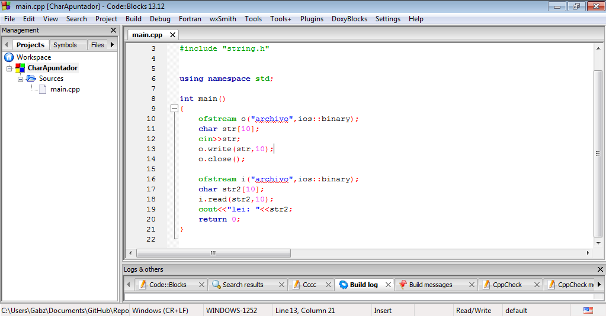

CharApuntador
=============
Los apuntadores son variables que guardan direcciones en C y C++. Proporcionan mucha utilidad al programador para accesar
y manipular datos de maneras que no es posible en otros lenguajes. Tambien son utiles para pasarle parametros a las 
funciones de tal modo que les permiten modificar y regresar valores a la rutina que las llama.
Referencia: http://eztigma.brinkster.net/apuntadores.html

Captura de Pantalla

